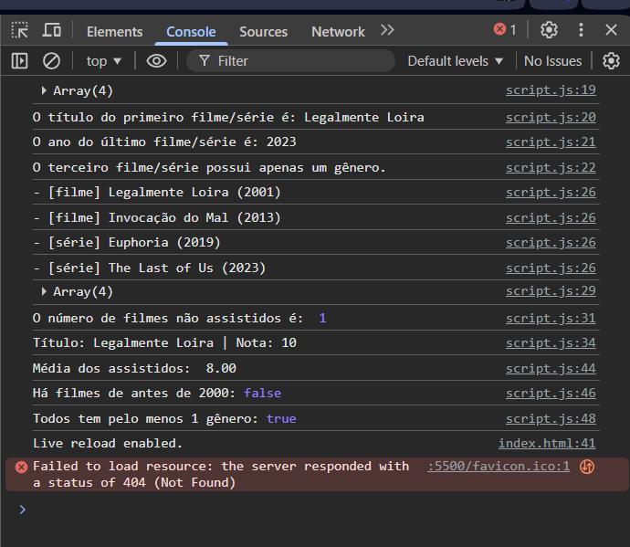

# Trabalho Prático - Semana 8

Nesta atividade, você fazer exercícios de programação para vai praticar a manipulação de objetos e arrays em JavaScript, passando pela definição de dados em notação **JSON (JavaScript Object Notation)**, acessando propriedades e itens, e usando iterators para processar os dados e gerar resultados.

## Informações Gerais

- Nome: Davi Emanuel de Sá Torres
- Matricula: 927565

## Prints do console do navegador

